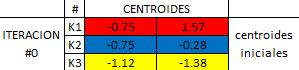
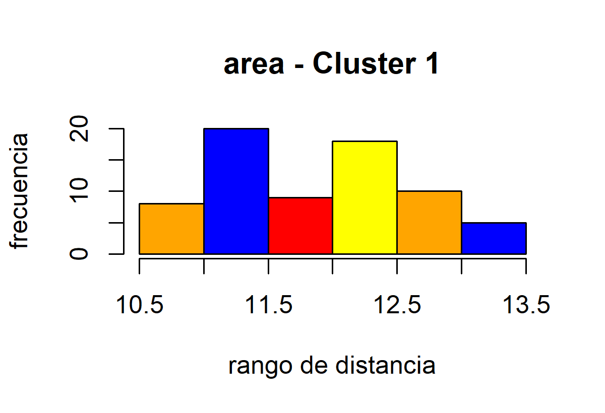
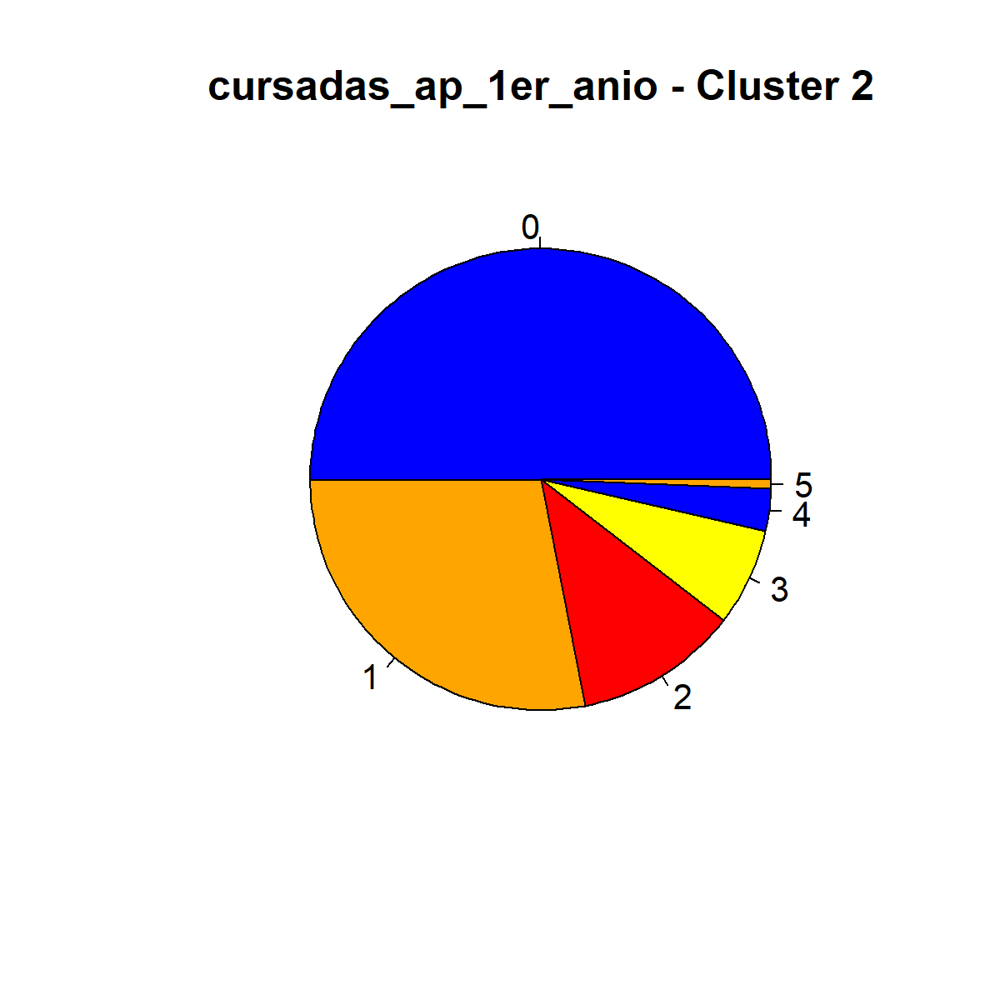

# Tp05.01ArbolesDeDecision

## 1. Medidas de distancia. Calcule la distancia entre los siguientes puntos y el centroide (2, 4) utilizando las medidas: euclídea, Manhattan y Minkowski (con p = 3):


Se puede observar que, dado el centroide: (2,4) el punto mas cercano es el punto: (3,7), esto se ve con el calculo de distancias, para el cual se obtienen los valores: 
* 0.63 (euclideana)
* 0.86 (Manhattan)
* 0.43 (Minkowski)

Que son los valores mas chicos, coincidiendo con la grafica. 

## 2. A continuación, calcule la distancia entre las diferentes variables de tipo categóricas con respecto a la instancia {1, lluvioso, templado, alta, fuerte}:

basandonos en la formula para el calculo de distancias con variables categoricas, armamos la matriz binaria correspondiente.


Se puede observar que los valores mas cercanos a cero, seran los mas cercanos a la instancia #1, en este caso las instancias #8 y #10.

## 3. Ahora, y a partir de los datos de la siguiente tabla, agrupe los datos de acuerdo al algoritmo k-medias utilizando la medida euclídea y con los puntos A1, A2 y A7 como centroides iniciales.

Resolucion: 

### a). normalizo por z-score


### b). establezco centroides iniciales



### c). calculo iteracion 0

 

####  c-1). actualizo centroides


### d). calculo iteracion 1


####  d-1). actualizo centroides


### e). calculo iteracion 2


####  e-1). actualizo centroides


### f). calculo iteracion 3


ya no hay cambios en los clusters, por lo tanto finalizo el algoritmo.

Centroides Finales y grafica de puntos

 

Conclusion: Se pueden observar tres cluster bien definidos.

## 4. K-means. Se provee un dataset sobre las características internas del núcleo de tres clases de trigo diferentes. Cargue el dataset en una de las herramientas de minería de datos provistas y resuelva:

* a) Utilice el algoritmo k-medias variando la cantidad de centroides a efectos de agrupar los datos de la manera más eficiente.


* b) ¿Cuál es la cantidad de grupos que permite un mejor agrupamiento de los datos? ¿Mediante cual métrica puede verificar esto?

La metrica que me permite verificar el mejor agrupamiento de los datos es el coeficiente de silueta


Se puede observar que un K=3 es la cantidad optima de agrupamientos.

* c) ¿Cuáles son las características más distintivas de cada uno de los cluters resultantes?

Realizando un analisis exploratorio de cada cluster, 
- Las caracteristicas distintivas son "el area", "el perimetro", "compact", "la longitud del kernel" y "el ancho del kernel", de estos solo analice los principales: area y perimetro. En base a los graficos pude observar lo siguiente:

 
 

- Se puede observar un area entre 18 ~ 19 
- Y un perimetro entre 16 ~ 16,5

 
 

- Se puede observar un area entre 11 ~ 11,5 
- Y un perimetro entre 13 ~ 13,5


- Se puede observar un area entre 14 ~ 14,5 
- Y un perimetro entre 14 ~ 15

## 5. Ahora, trabaje sobre el dataset abandono_cuantitativo.csv:

* a) Escoja los features que a su entender permitan un mejor agrupamiento, pre-procese los mismos y entrene un modelo a partir de K-Means. 

En base a un Analisis de Componentes Principales, puedo observar que las variables que describen mejor el dataset son: 

        'c_noausentes_1er_anio',
        'cursadas_ap_1er_anio',
        'c_libres_1er_anio',
        'cursadas_1er_anio',
        'fracaso_academico',


- Los features escogidos son

        'c_noausentes_1er_anio',
        'cursadas_ap_1er_anio',
        'c_libres_1er_anio',
        'cursadas_1er_anio',
        'fracaso_academico',

A partir del cual, se obtiene un modelo que tiene cluster superpuestos. Podria seguir acotando el analisis, eliminando mas variables y subiria el coeficiente de silueta al 60%, pero me parecio que estaba acotando demasiado y estaria sacando del dataset variables que explican una parte importante del mismo, en pos de buscar un mejor agrupamiento de los datos. La idea tampoco es perder imformacion, asi que elegi quedarme con el 50% de coeficiente de silueta y 3 grupos. 

   

* b) Analice y describa las características más salientes de cada uno de los grupos encontrados por el algoritmo.

De los grupos resultantes analice dos variables principales:

- 'cursadas_ap_1er_anio' y 
- 'fracaso_academico', 

Y a partir de un analisis grafico de los datos, realice las siguientes observaciones.


- Se puede observar que: se encuentran aquellos estudiantes que mayormente, no cursaron materias el primer 1er año y fracasaron academicamente. 


- El segundo grupo: hay estudiantes que cursaron en promedio 2 materias y ninguno fracaso academicamente. 




- Por ultimo, este cluster es parecido al cluster 0, con la diferencia que tenemos estudiantes que no fracasaron academicamente a pesar de que, en su mayoria no cursaron materias el primer año.

* c) Encuentre la cantidad de grupos que logran el mejor agrupamiento para los datos. Justifique la elección a partir de métricas y gráficas de los conglomerados resultantes.

| cant_cluster | coeficiente_silueta |
| ------------- | ------------- |
| 2  | 0.4172791289245163  |
| 3  | 0.5039014903639526  |
| 4  | 0.43057631276938785  |
| 5  | 0.44976901761026955  |

Segun la metrica de silueta se puede observar que tres cluster logran el mejor agrupamiento. 

* d) Ahora aplique algún algoritmo jerárquico a efectos de agrupar los datos. ¿Cuál nivel se corresponde con el agrupamiento realizado por k-medias en el punto 6) a)?


Se puede observar que, a una distancia aproximada de 7 corresponde una agrupancion de k=4. 
A una distancia aproximada de 8 se corresponde con el agrupamiento realizado por k-medias en el punto 6) a).

* e) ¿El agrupamiento jerárquico permite encontrar una mejor forma de agrupar los datos? Si fuera así, ¿Cuál es ese agrupamiento?

Dependiente del tipo de agrupamiento utilizado, se puede obtener un mejor agrupamiento, en el caso anterior se uso un metodo de linkage de `Complete Linkage`, lo que permitio observar un agrupamiento mas uniforme.

## 6. Algoritmos jerárquicos. Incorpore en Colab nuevamente el dataset del punto 5 y realice las siguientes actividades:

* a) Realice el agrupamiento de los datos utilizando diferentes parámetros.

Variando el parametro del tipo de linkage se pueden realizar dintintos agrupamientos: Como ser `single`, `average`, `centroid` y `complete`

```
from scipy.cluster.hierarchy import dendrogram, linkage

# H = linkage(scaled_1, 'single')
# H = linkage(scaled_1, 'average')
# H = linkage(scaled_1, 'centroid')
H = linkage(scaled_1, 'complete')

from scipy.spatial.distance import pdist, squareform

squareform(pdist(scaled_1))

max_d = 7.08
plt.figure(figsize=(25, 10))
plt.title('Dendrograma')
plt.xlabel('Observaciones')
plt.ylabel('Distancia')
dendrogram(
    H, truncate_mode='mlab',
    p=5, leaf_rotation=90.,
    leaf_font_size=8.,
)
plt.axhline(y=max_d, c='k')
plt.show()

```

* b) Grafique el resultado y escoja cual es el nivel que mejor agrupa los datos.

#### Dendograma `AVERAGE`

#### Dendograma `CENTROID`

#### Dendograma `SINGLE`

#### Dendograma `COMPLETE`


Se puede observar que el dendograma `Complete` es el que mejor agrupa los datos.


